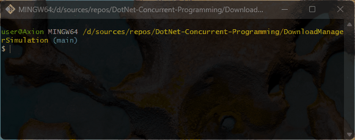
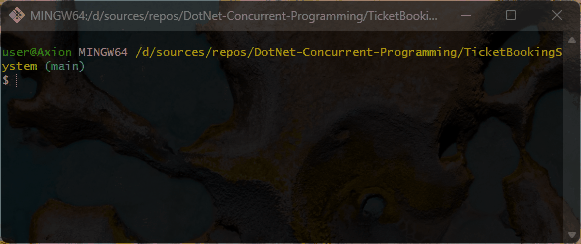
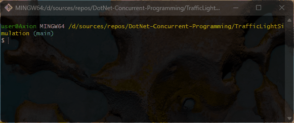

# 🪢 DotNet-Concurrent-Programming
Practical C# multithreading and concurrency projects covering synchronization, thread safety, producer-consumer patterns, and real-world simulations.

## 💻 About program
*Projects:*
- *ParallelCounter - 3 threads were used simultaneously*
- *Sum numbers - Numbers up to a million were added in threads*
- *SharedBankAccount - Multiple threads worked on the Balance field*
- *ProducerConsumer - Adding and retrieving are assigned to separate threads*
- *ThreadSafeLogger - Threads worked on the file*
- *SequentialExecutionWithJoin - The task was assigned to 3 threads and processed sequentially*
- *PrimeNumberFinder - Prime number finding intervals have been assigned to multiple threads*
- *BackgroundAutosaveSimulation - Background thread performance demonstrated*
- *DownloadManagerSimulation - Each file download is assigned to a separate thread*
- *TicketBookingSystem - Ticketing via threads has been delegated to individual users*
- *TrafficLightSimulation - Separate threads handling the lights were running*

### 🪟 Preview
- *DownloadManagerSimulation preview*

- *TicketBookingSystem preview*

- *TrafficLightSimulation preview*

### ⚙️ Technologies
 

## 🧑‍💻 I worked on it
- *Elements of OOP: classes, objects, enums*
- *Classes: Console, ConsoleColor, ConsoleKey, DirectoryInfo, Thread*
- *Data types: int, string, bool*
- *Access modifiers: public, private*
- *Strings: Regular, Interpolation*
- *Looping statements: for, do while, while*
- *Condition statements: if else, switch*